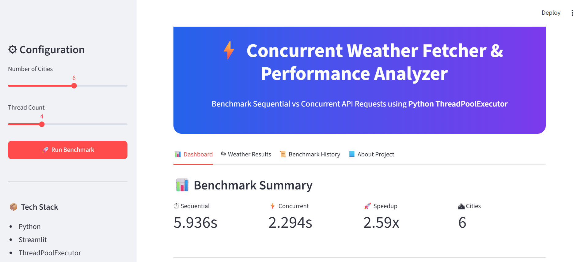
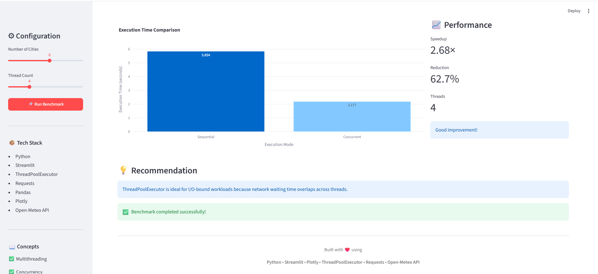
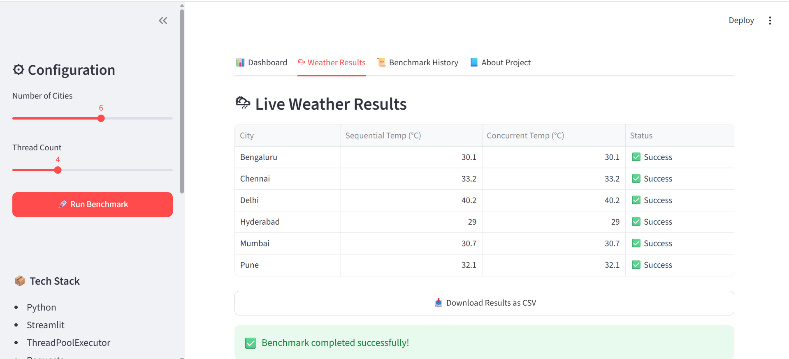
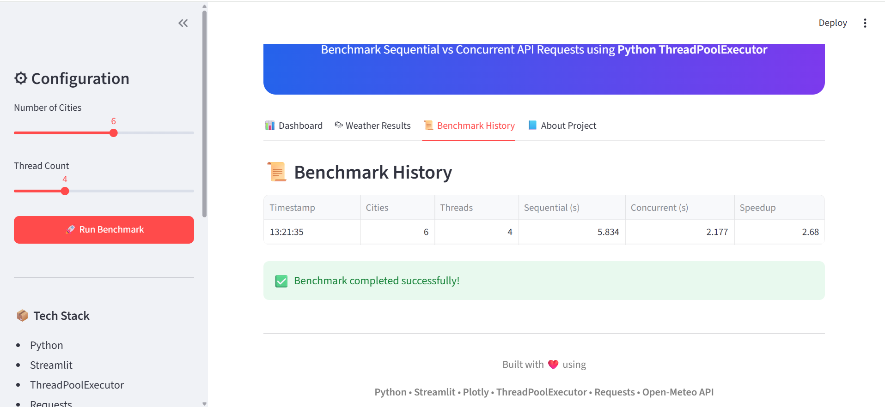
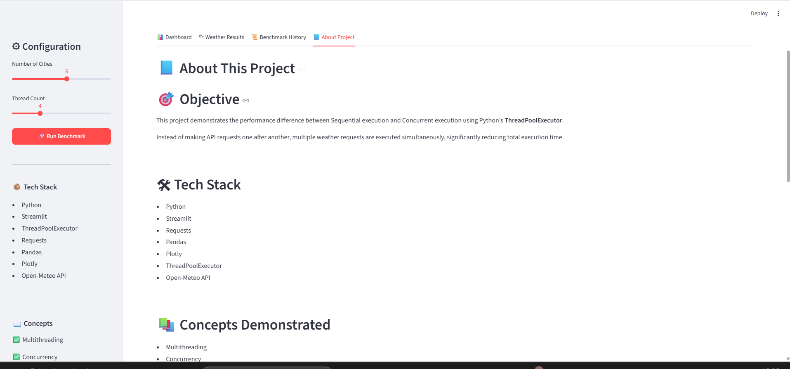

# ⚡ Concurrent Weather Performance Analyzer


A modern **Streamlit dashboard** that demonstrates how Python concurrency improves the performance of **I/O-bound API requests**. This project benchmarks **Sequential** and **Concurrent** weather data retrieval using Python's **ThreadPoolExecutor**, measures execution time, visualizes the results, and highlights the performance gains achieved through multithreading.

---

## 🚀 Live Demo

🌐 **Application:** https://concurrent-weather-performance-analyzer.streamlit.app/

📂 **GitHub Repository:** https://github.com/Shivani-22-ai/concurrent-weather-performance-analyzer

----

# 📌 Project Overview

Many real-world applications make multiple API requests. Executing them one after another wastes valuable waiting time.

This project compares:

* Sequential API execution
* Concurrent API execution using `ThreadPoolExecutor`

and demonstrates how concurrency significantly reduces execution time for **I/O-bound workloads**.

---

# ✨ Features

* 🌦 Fetches live weather data using the **Open-Meteo API**
* ⚡ Compares Sequential vs Concurrent execution
* 📊 Interactive Streamlit dashboard
* 📈 Plotly performance visualization
* 🚀 Speedup and execution-time reduction metrics
* 📋 Benchmark history tracking
* 📥 Export weather results as CSV
* 📚 Educational explanation of Python concurrency

---

# 📷 Application Screenshots

## 🏠 Home



---

## 📊 Dashboard



---

## 🌦 Weather Results



---
## 📜 Benchmark History



---

## 📘 About Project



---

# 🏗 System Architecture

```text
                 User
                   │
                   ▼
        Streamlit Dashboard
                   │
        User Configuration
        (Cities & Threads)
                   │
                   ▼
         Weather Fetcher Module
            (fetcher.py)
           /               \
          /                 \
 Sequential             Concurrent
 Execution              Execution
      │                     │
      │             ThreadPoolExecutor
      │                     │
      └──────────────┬──────┘
                     ▼
         Open-Meteo Weather API
                     │
                     ▼
          Weather Data (JSON)
                     │
                     ▼
            Pandas Processing
                     │
      ┌──────────────┼──────────────┐
      ▼              ▼              ▼
 Performance      Plotly Chart   Weather Table
    Metrics                          │
                                     ▼
                             CSV Export & History
```

---

# 📊 Sample Benchmark Results

| Mode       | Execution Time |
| ---------- | -------------: |
| Sequential |   4.82 seconds |
| Concurrent |   0.91 seconds |

### Performance Improvement

* 🚀 Speedup: **5.30×**
* ⚡ Execution Time Reduced: **81%**

> *Results may vary depending on internet speed and API response time.*

---

# 🧠 Concepts Demonstrated

* Python Multithreading
* ThreadPoolExecutor
* Concurrency
* I/O-bound Programming
* REST API Integration
* Performance Benchmarking
* Interactive Dashboards
* Data Visualization

---

# 🛠 Tech Stack

| Technology         | Purpose               |
| ------------------ | --------------------- |
| Python             | Core Programming      |
| Streamlit          | Interactive Dashboard |
| Requests           | API Communication     |
| Plotly             | Data Visualization    |
| Pandas             | Data Processing       |
| ThreadPoolExecutor | Concurrent Execution  |
| Open-Meteo API     | Weather Data          |

---

# 📂 Project Structure

```text
weather-dashboard/
│
├── app.py
├── README.md
├── requirements.txt
├── race_condition_demo.py
│
├── src/
│   └── weather_dashboard/
│       ├── __init__.py
│       └── fetcher.py
│
└── screenshots/
    ├── home.png
    ├── dashboard.png
    ├── weather-results.png
    ├── benchmark-history.png
    └── about.png
```

---

# ⚙ Installation

## ⚙️ Installation

### 1. Clone the repository

```bash
git clone https://github.com/Shivani-22-ai/concurrent-weather-performance-analyzer.git
```

### 2. Navigate to the project directory

```bash
cd concurrent-weather-performance-analyzer
```

### 3. (Optional but Recommended) Create a virtual environment

**Windows**

```bash
python -m venv venv
venv\Scripts\activate
```

**macOS / Linux**

```bash
python3 -m venv venv
source venv/bin/activate
```

### 4. Install the required dependencies

```bash
pip install -r requirements.txt
```

### 5. Launch the Streamlit application

```bash
python -m streamlit run app.py
```

The application will open automatically in your default browser.

If it doesn't, open:

```
http://localhost:8501
```

---

# 🔍 How It Works

### Sequential Execution

```text
Request 1
   ↓
Request 2
   ↓
Request 3
   ↓
...
   ↓
Request N
```

Each request waits for the previous one to complete before starting the next.

### Concurrent Execution

```text
Thread 1 ───► Request 1
Thread 2 ───► Request 2
Thread 3 ───► Request 3
...
Thread N ───► Request N
```

Multiple requests execute simultaneously, reducing the total waiting time.

---

# 💡 Key Learnings

* Concurrency is highly effective for **I/O-bound tasks**.
* `ThreadPoolExecutor` enables multiple API requests to execute simultaneously.
* Overlapping network waiting time significantly reduces total execution time.
* Performance benchmarking provides measurable insights into optimization.

---

# 🌍 Real-World Applications

* Weather Monitoring Systems
* Stock Market Data Collection
* Web Scraping Pipelines
* Data Engineering Workflows
* Microservices
* ETL Pipelines
* Network Monitoring Tools

---

# 🔮 Future Enhancements

* 🌍 Interactive weather map
* 📈 Benchmark scaling analysis
* 📄 PDF benchmark reports
* ⚡ AsyncIO implementation comparison
* ☁ Cloud deployment analytics

---

# 👩‍💻 Author

**Shivani Lokinindi**

**B.Tech – Computer Science & Engineering (AI & ML)**

Interested in Artificial Intelligence, Machine Learning, Python, and Software Engineering.

---

# ⭐ If you found this project useful

* ⭐ Star this repository
* 🍴 Fork the project
* 💬 Share your feedback

---

# 📄 License

This project is licensed under the **MIT License**.

